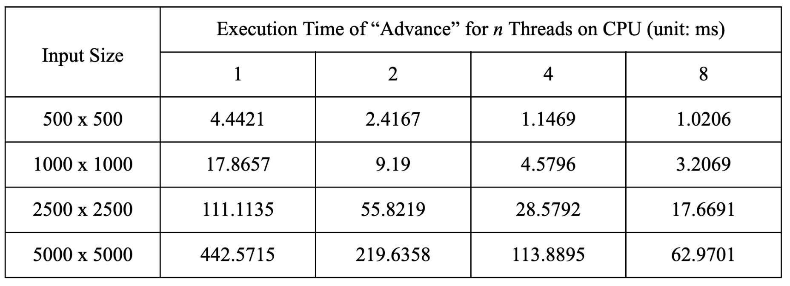
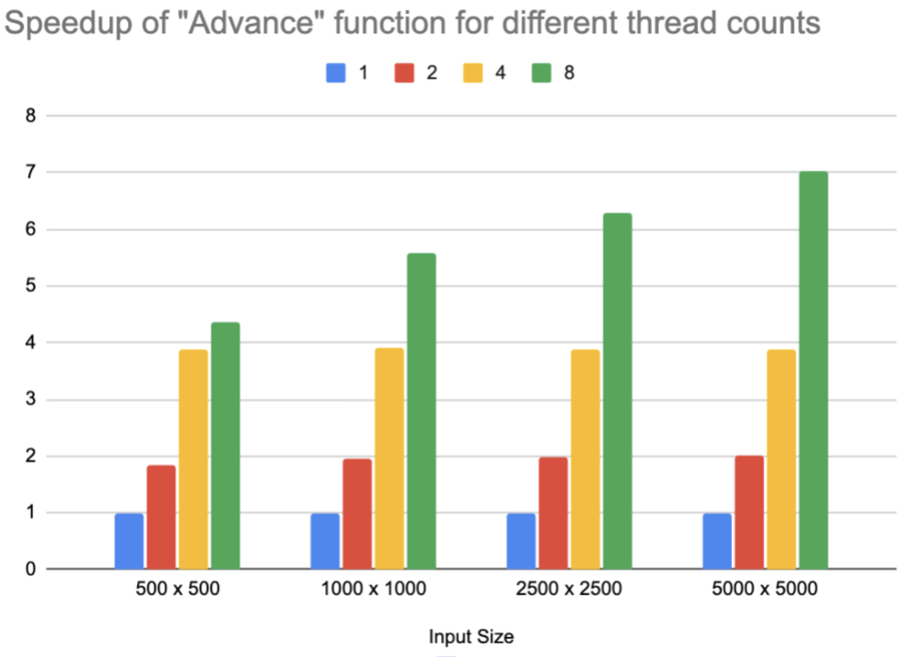
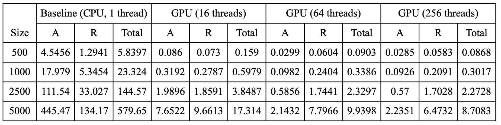
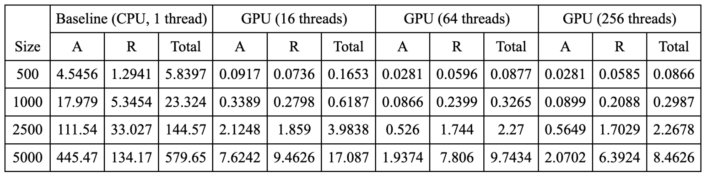
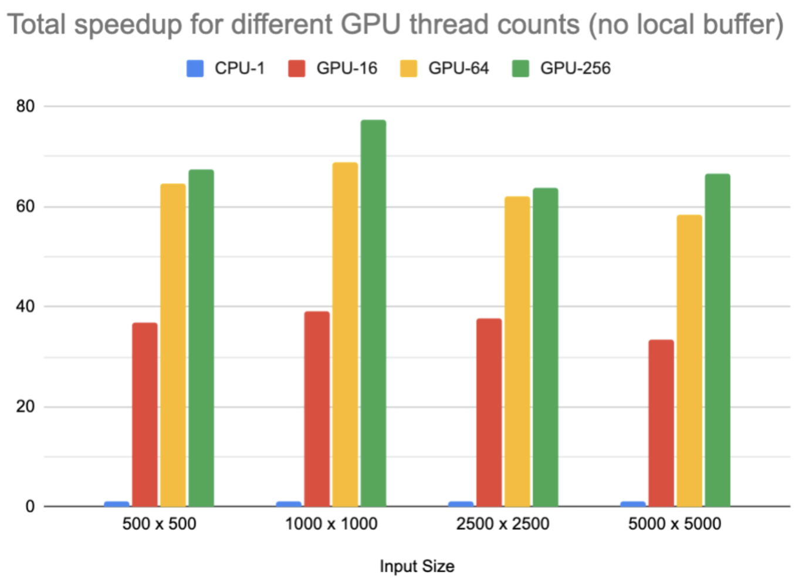
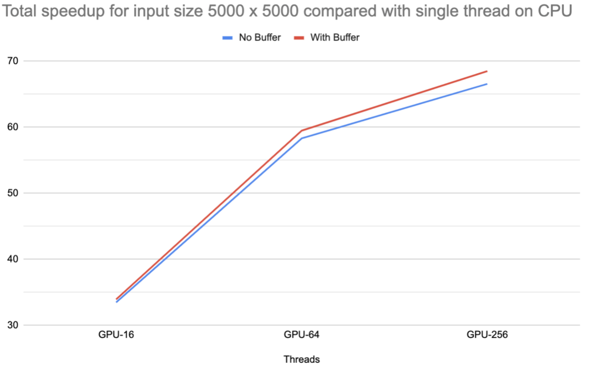
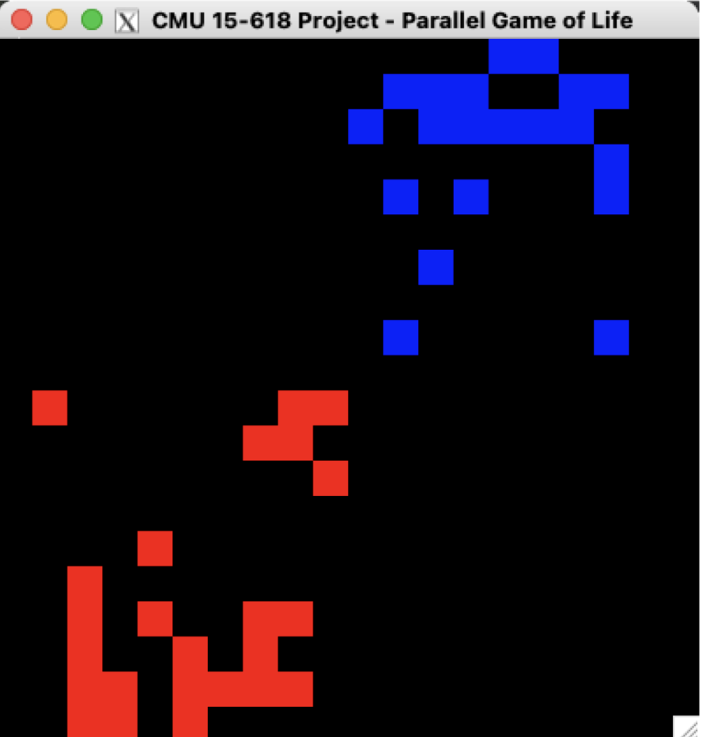
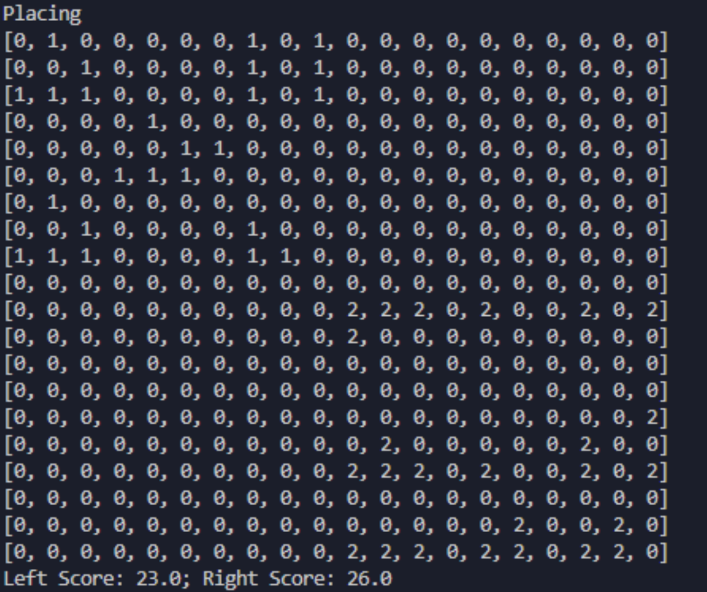

# Parallel Game of Life - Final Report

Mingyuan Ding (mingyuad), Li Shi (lishi)

## Summary

We implement a parallel simulator of Conway’s Game of Life in OpenMP and CUDA and reach nearly linear speedup in updating cell states. Meanwhile, we implement an AI that learns from self play and genetic algorithms so that it can play our game of life battle.

## Background

The Game of Life is a cellular automation devised by the British mathematician John Horton Conway in 1970. The evolution of cells is determined by their initial state on a two-dimensional grid, where each cell can either be alive or dead. Our project is divided into two phases.

### Parallel Game Simulation

The first phase includes implementing a parallel game simulator that supports the traditional rule of the game of life, i.e.,

- Any live cell with fewer than two live neighbors dies, as if by underpopulation.

- Any live cell with two or three live neighbors lives on to the next generation.

- Any live cell with more than three live neighbors dies, as if by overpopulation.

- Any dead cell with exactly three live neighbors becomes a live cell, as if by reproduction.

There is no complicated data structure or operations on data structures in this part. The game simply requires synchronous updates on all the cells in the grid. As for each update the memory access pattern is like a convolution kernel that loads the data from neighboring cells and writes updated data, it is a typical memory-bound application but can still significantly benefit from parallelization due to strong temporal and spatial locality of memory access. Though the current cell depends on all neighboring cells, it is possible to parallelize the computation with two arrays and update like a ping-pong buffer, similar to particles updating in N-body simulation in lab 3 and 4. Based on this, it is a data-parallel application and is possible to be parallelized in several ways, e.g., in horizontal or vertical direction, or in tiles similar to blocked matrix multiplication to utilize the locality. For all parallelization ways the workload can be evenly distributed among compute units as all the cells need to be updated, so in this project we don’t need to look at this. However, the application may not be amenable to SIMD execution as the update of current cell needs to often access cells in the last or next line, but is only dependent on 8 cells, so SIMD may not speed up the execution due to this irregular data access and computation.

Previous works have shown the possibility of performing parallel simulation for game of life, including on different platforms like GPU [1] or FPGA [2], or parallel programming frameworks like OpenCL [3] or CUDA, and the values of such parallelization with quantitative analysis [4].

## Parallel AI Model

In the second phase, we modify the game to have two players and play in a competitive fashion. Two players place initial cells on the grid with given constraints. We manage to train an AI using reinforcement learning to play against either human players or itself. The training and execution of AI also benefit from parallel execution.

The AI is a fully connected neural network with 3 hidden layers. The input to the neural network is the two initial cells from both the AI and its opponent, and the output is the coordinates of its next move. 

We train our AI using genetic algorithms, that is having a batch of challenger AI all playing against the same “Best AI” and the winning challenger with the highest score is picked to be the new Best AI. Clone and mutate the new Best AI to form a new batch of challengers. Therefore, there are heavy computations in simulating the battle between each of the challengers and the Best. However, each of the simulations is also completely independent of the other, meaning a great parallelism opportunity here.

As for executing the AI, there are also parallel opportunities since there are multiple matrix-vector multiplications. However, our competitive game mode is placing pieces in turns. It cannot be paralleled since the next game state when the AI places its next piece is unknown since it cannot know where its opponent will place.

## Approach

### Parallel Game Simulation

In this phase, we are targeting GHC machines with Intel i7-9700 CPU and NVidia RTX 2080. We use OpenMP targeting multi-threading on CPU and CUDA targeting parallelism on GPU. In terms of OpenMP implementation, as there is no complex dependencies and the workload should be balanced enough, we simply write a “parallel for” pragma in front of the outmost loop, such that for both updating and rendering process, each thread is evenly assigned the work line by line. In terms of CUDA implementation, we map the work to GPU threads with blocks, i.e., let cells in every single block be updated in parallel, which is different from the CPU implementation that parallelizes the work in lines. Fortunately, due to the good properties of the original workload, we don’t need to modify a lot from the basic serial implementation.

In addition, we try to optimize the memory access by reducing the number of memory loads. To update each cell, it needs to load the data for all 8 neighboring cells and also itself, plus a memory store, so there are 10 memory operations in total. Meanwhile it requires 8 additions in serial to count the alive cells around the current cell plus 2 comparisons, so there are 10 arithmetic operations. Therefore, the arithmetic density of simulating game of life is 1, which is low compared to other scientific computing applications, so it is important to optimize memory accesses and reduce redundant memory loads.

In the OpenMP implementation, we try to perform such optimizations but do not get good enough results. The reason is mainly because modern out-of-order CPUs are already good at handling locality, as (1) high cache hit rate due to regular data access pattern and (2) predictable memory access which makes prefetch easier. Thus, we keep the simplest OpenMP implementation with a single “parallel for” for both game simulation and image rendering.

In the CUDA implementation, similar to lab 2, we try to implement a local buffer and let different threads load the data into the buffer in the current block simultaneously. It does show some performance improvement but the performance gain is almost negligible. The reason is similar to the OpenMP implementation, and meanwhile it requires an extra thread synchronization and cancels the performance improvement brought by the local buffer.

In this part we develop our game simulation code from scratch, but the framework code is based on lab 2 start code.

Additionally, to demonstrate our work in the poster session, we manage to visualize the game simulation similar to lab 2. For example, a demo of “Gosper glider gun” simulation with 100 x 100 frame size is shown below.


### Parallel AI Model

For the AI part, we are using Python and training on the GHC machine. We are using reinforcement learning to train our agents. Since there are two sides competing against each other, we let the agent play against themselves and use genetic algorithms to evolve our agents to become better at playing our game. Self-play and genetic algorithms give a great opportunity to parallel. As we mentioned in part 2, each self-play simulation is completely independent of each other. This creates a great opportunity for multi-core parallelization. Each core will simulate a subset of the self-play and all return the score to the master for comparing and picking the best agent. Python has multiprocessing for assigning tasks to different cores as the pool. The function running in each core contains initialization of the simulation environment, getting the input from the Best Agent and one unique challenger agent, and then simulating the game to get the score. Therefore, our training algorithm is scaling with the number of processing cores. However, it is not linear because there are uneven workloads due to the simulation that may exit early if there is no more life left on the grid.

The difficulty of our AI is that we did not depend on any APIs. We wrote a genetic algorithm and trained it from scratch. Our game is also very unique so we have to decide the rules and create our own reward function. We would like our agent to achieve a high life count in short steps and also last a long time. Thus, we combine these two parts to be our reward function. For each new generation of challenge agents, 70% of them have a 0.1 mutation rate to search for a local maximum, and 20% and 10% of them have 0.3 and 0.7 mutation rates respectively to explore the solution space.

Training AI is also very time-consuming since verification of a good reward function and evolution policy will take time to see the result. We put our trained model against a random agent and verify the performance with the win rate. It is also unlike optimizing the game simulation, optimizing the training algorithm requires a higher level of abstraction understanding of both the game and training. We are also facing a challenge that the performance of the training needs more training to show and we have no way of knowing whether the increase in win rate will come or not. Several reward functions and training strategies were tested and we landed a combination that can give over 60% win rate against a random agent in 1000 episodes of training.

```
Num of Game: 100; Win: 61; Draw: 4; Win rate: 0.61, Draw rate: 0.04
```

## Results

### General Environment Setup

All the experiments are running on GHC cluster machines (CPU: Intel i7-9700, GPU: NVidia RTX 2080).

### Parallel Game Simulation

Parallel simulation of game of life can be analyzed in two parts: state advance and image rendering. For both functions, performance is measured via execution time per update. For the convenience of comparison, we set the result of a single thread running on CPU as baseline.

The size of inputs are set to 500 x 500, 1000 x 1000, 2500 x 2500, and 5000 x 5000. The specific data values are not important as the computation and memory access are independent of input data, thus we have a random input generator to generate the initial state of frames.

**OpenMP Implementation**

The original performance data of the “Advance” function is recorded in the following table.



Setting 1 thread on CPU as baseline, the performance speedup is summarized in the following chart.



As the workload of simulation for game of life is evenly distributed to each thread, we observe a nearly-linear speedup when increasing the number of threads. The main bottleneck of performance is memory bandwidth and scheduling overhead of OpenMP runtime system, so we can observe that when the number of threads is low, we can have almost linear performance gain, but when the number of threads continues to increase, the speedup starts to deviate from linear trend. However, it is interesting to note that when the size of inputs increases, the speedup for 8 threads also increases, mainly because the OpenMP scheduling overhead is further amortized and each thread has more work to do rather than waiting.

In the meantime, we observe that the execution time of the “Render” function remains almost the same when the number of threads increases. We debug the code and find that though we add the pragma and try various settings to parallelize the loop, the runtime schedule is always using only 1 thread. The reason is that we have intricate array index calculation before accessing the element in the frame, and the compiler is conservative when performing pointer analysis and leads to the result that there might be potential loop carry dependencies. Consequently OpenMP decides to give up parallelizing the execution, and after searching documentation there is no way to override this and tell the compiler to skip checking dependencies.

**CUDA Implementation**

The raw data of running the parallel simulator of game of life on GPU without local buffer optimization is recorded in the following table. A stands for “Advance” function and R stands for “Render” function. All the timing values are in milliseconds.



The data of parallel simulation on GPU with local buffer optimization is in the table below.



Next, we perform further data analysis with charts.



We can observe a significant speedup in both advance and render functions executed on GPU compared with CPU. The way we control the “thread counts” is to define the number of threads in one block before invoking the kernel. However, though it seems that for the case of 16 threads there’s a “super-linear” speedup, the fact is that the GPU is able to schedule other tasks on its processors in the meantime such that the actual parallelism is greater than 16, but due to scheduling overhead, GPU parallelism cannot be fully utilized. However, when the number of threads in one block increases to 64 or 256, the compute resources on the GPU can be further used and performance is further improved. When the number of threads is high, as the application itself is memory-bound, memory bandwidth soon starts to limit the performance and we cannot gain linear speedup any more.



Unfortunately, when we try to add a local buffer to the CUDA kernel, the performance speedup is not as high as we expected. It only improves performance by a very limited amount. Such cases usually happen in two scenarios: (1) input or output array size is too small so that local buffer does not help a lot, or (2) the application is compute-bound so memory access is not the bottleneck that limits the performance. However, these two don't apply in our game of life simulation application, and the input array is large enough and it is clearly memory-bound. The first major reason is due to the explicit synchronization between data load and computation. As the memory bandwidth is limited, it is possible that early threads complete loading and wait for later threads to complete. The other minor reason might be that the GPU is applying prefetch techniques as the data access in this application is regular and predictable. As a result, adding a local buffer cannot help to significantly improve kernel performance.

**Discussion: OpenMP vs. CUDA**

In this application to simulate the game of life, CUDA seems to work better than OpenMP implementation based on the following reasons:

1. GPU architecture: As GPU targets large-scale parallel processing with many small processors, it can handle many more threads than the CPU, which allows for efficient parallelization especially for simple and repetitive tasks like cell updating.

1. GPU memory: Usually GPUs have higher memory bandwidth (GDDR, HBM, etc.) than CPU (DDR, LPDDR, etc.). Thus, GPU is more suitable for simulation of game of life and other kinds of applications that require a high memory bandwidth.

1. Task distribution and granularity: GPU is good at handling small and identical tasks while CPU is good at handling large and irregular tasks. Game of life simulation belongs to the former tasks.

However, it doesn’t mean that CUDA or other GPU programming framework is always better than OpenMP or other framework targeting CPU multithreading. For example, for those applications with many branches or even more complicated control flows like recursion, OpenMP shows greater flexibility, e.g., buildQuadTree recursive implementation in lab 3. Meanwhile, OpenMP is also easier to use and debug, and can be used with more open platforms rather than only NVidia GPUs.

### Parallel AI Model

We perform our experiment with the following parameters:

```
grid_size = 20
init_size = 10
sim_cycles = 1000
num_place = 25
num_model = 25
episodes = 1
```

Grid_size is the side length of the simulation grid, init_size is the side length of the input grid, sim_cycles is the number of simulation steps, num_place is the number of pieces each side would place into the input gird, num_model is the number of challengers each generation, and episodes is how many generations there will be. For the purpose of the experiment, we just set the episodes to be 1 just to show the speedup rather than actually training the model.

And the result is as follows:

```
Naive Training: 29.4144 s
NumPy Training: 8.9206 s
Parallel Training: 4.4696 s
NumPy + Parallel Training: 2.2111 s
```

There are parts that can be optimized in training the AI: Execution, game simulation, and genetic training algorithm.

The execution consists of multiple matrix-vector multiplication. A naive and serial implementation in Python is very slow. Luckily, NumPy provides a fast and optimized for Python matrix-vector multiplication. This could yield about 3x faster execution compared to the Naive matrix-vector multiplication.

Game simulation is related to our parallel game simulation. Game simulation may take a large part of the training since the game of life may not easily be predicted by a given initial state. And we further complicated the game so we have to simulate every battle to get the correct reward. Having a parallel simulated game environment would also speed up the training.

Lastly, genetic training algorithms can be parallel over different cores. Due to the nature of genetic algorithms, each of the battles between the challenger and the best agent is completely independent. Assigning each core to simulate a subset of the battles could significantly increase the training speed at about 6.5x faster than naive.

The beauty of parallel training is that all three parts can be stacked to give an even faster speedup. With all three together, we are able to achieve a 13.3x faster training compared to naive.

Even though the speedup is promising, this is not scaling ideally with the vector operation supported by the CPU and 8 cores GHC machines have. The reason for this is that there are still communication costs between cores and also part of the training cannot be parallelized, such as picking the best agent of the generation.

Finally, here is a game between our best agent and how they place their pieces.



We can see that our agent starts to understand that they need to have a good fundation for their population to grow at a place that is far from the opponent and also have some defences barriers at the front line.

## References

1. Fujita, Toru & Nakano, Koji & Ito, Yasuaki. (2016). Fast Simulation of Conway’s Game of Life Using Bitwise Parallel Bulk Computation on a GPU.

1. Nizam, Zamrath & Ramsan & Sajeev & Muralitharan. (2014). FPGA Based Game of Life.

1. Rumpf, Thomas. (2010). Conway’s Game of Life Accelerated with OpenCL.

1. Ma, Longfei & Chen, Xue & Meng, Zhouxiang. (2012). A Performance Analysis of the Game of Life Based on Parallel Algorithm.

## Team

Mingyuan Ding: 50%

- Implementation of the reinforcement learning AI using Python and NumPy.

- Train the agent via genetic algorithm to learn how to play our version of game of life well

- Optimize the training process by using multi-core to parallel the training

Li Shi: 50%

- Implement game simulation, including serial implementation as infrastructure and parallel implementation in OpenMP and CUDA, and visualize the simulation process

- Optimize simulation parallelism and perform data analysis and visualization

## Appendix

A game between Kevin (left) and our best agent (right). Kevin places some Gliders but lost to our agent with a score of 23 to 26.


