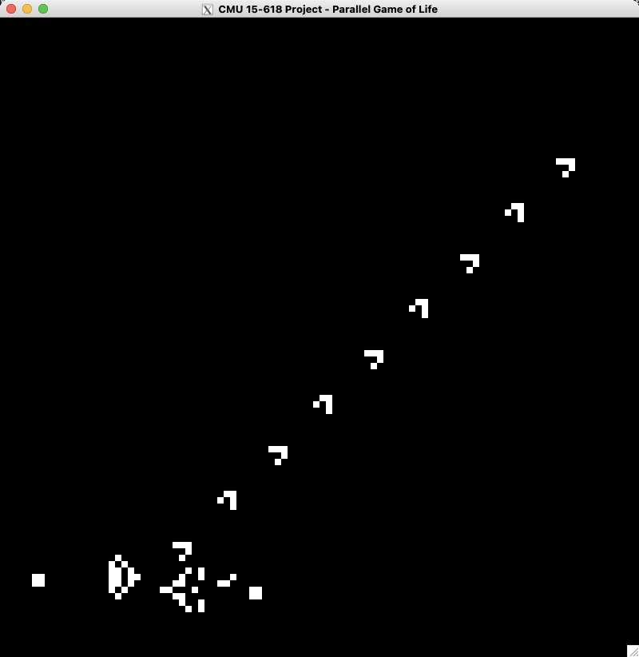
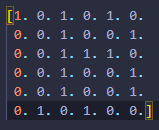

# 15-618 S23 Final Project - Parallel Conway's Game of Life

Mingyuan Ding (mingyuad), Li Shi (lishi)

## Project Milestone

[Milestone Report](./Milestone.pdf)

### Revised Schedule

- Week 3 (4/18 - 4/22): Improve visualization of game simulation (Li). Implement basic optimization for parallel simulation in CUDA (Li). Link simulation framework to training environment (Kevin).

- Week 4 (4/23 - 4/29): Perform quantitative performance analysis of simulation (Li). Implement parallel simulation in OpenMP and compare it with CUDA if time permits (Li). Implement a better reward function in the RL model (Kevin).

- Week 5 (4/30 - 5/5): Implement a better training algorithm and optimize the model (Kevin). Write the final report and prepare for the poster session (Li & Kevin).

### Progress Summary

For the game simulation part, we develop our framework based on our assignment 2 code which supports simulation on both CPU and GPU, and we can choose to either display the game simulation on screen for demo, or dump the output to files. CPU simulation is a basic serial version of implementation and should be regarded as the baseline of performance that can be used as reference for later evaluation. It simply iterates over all the pixels in the frame and calculates the next state of each pixel. CUDA implementation tries to accelerate this process by parallelizing both next state calculation and rendering at pixel level. The application itself is not hard to do workload balance and data synchronization, and current results show that on the 1000 x 1000 frame with random input, we can observe about 25~30x speedup without any aggressive optimization. We may continue to optimize the program or try other parallelism models like OpenMP and compare the speedup to find the best platform to run simulation.

For the AI training part, we are currently using a serial implementation on both the simulator and training. As both the simulation and training environment are in development, we currently trained an AI to find the best openings in the given initial box and trained it using a genetic algorithm. The reward function of its action is calculated by the max lives it will achieve divided by the number of generations plus the lives at the end of the simulation. The AI is a three-hidden layer fully connected neural network. Each training episode will have a list of models given its initial box and the one with the highest reward is chosen to be the baseline of the next generation. Each model of a generation is a mutation of the best model from the previous generation where 70% with a mutation rate of 0.1, 20% with a mutation rate of 0.3, and 10% with a mutation rate of 0.7 keep the exploration during training.

### Revised Goals & Deliverables for Poster Session

For the simulation part, we don’t need to make any modifications in our proposal. We will continue developing our parallel simulation program and perform quantitative analysis on the speedup of parallelization. In the poster session we will have a live demo on simulation of Conway’s game of life.

For the AI training side, we are making progress but do not know for sure how the competitive AI will turn out since it is a much more complicated environment. However, after weeks of learning and researching, we have nailed down some basic reinforcement learning approaches. Meanwhile we could have some demos on the pattern our AI finds and some competitive plays between humans and AI and also between AI themselves. Moreover, we are currently running everything serially. Another big objective is to make it parallel. We will try to implement ourselves using Pytorch if the process is smooth and we can get good results.

### Preliminary Results
For the simulation part, we have both CPU serial simulation and GPU parallel simulation. For example, a demo of “Gosper glider gun” simulation with 100 x 100 frame size is shown below.

For the AI training part, test training is performed and the parameters and results are in the appendix.

### Concerns

For the simulation part, we don’t have much concerns on completing this part, but we may still try to find ways to further optimize for performance, e.g., optimize for sparse frames or other interesting input patterns.

For the AI training part, we want to have a good reward function describing how good the initial box the AI gives is. Currently, we are using a reward function that we come up with ourselves and we are not confident about its performance. The reward function is such a pivotal part of reinforcement learning. We also want to use some open-source training frameworks but we are not confident about how compatible our environment will be with those frameworks.

### Appendix

**Reinforcement learning parameter**

- grid_size = 60

- init_size = 6

- sim_cycles = 200

- num_model = 20

- episodes = 50

**Training result**

Episode: 50, Best Model: 0, Best Score: 249.24

Training: 713.1318709850311 seconds

Video: https://drive.google.com/file/d/180H-QibPKS5qWnP8hcCn74zlM4gTCoDl

## Project Proposal

[Proposal](./Proposal.pdf)

### Project Webpage

https://15618-parallel-game-of-life.github.io

### Summary

We plan to implement a parallel Conway’s game of life simulation and a reinforcement learning AI model to play against the player or itself.

### Background

The Game of Life is a cellular automation devised by the British mathematician John Horton Conway in 1970. The evolution of cells is determined by their initial state on a two-dimensional grid, where each cell can either be alive or dead. Our project can be divided into two phases. The first phase includes implementing a parallel game simulator that supports the traditional rule of the game of life, i.e.,

1. Any live cell with fewer than two live neighbors dies, as if by underpopulation.

1. Any live cell with two or three live neighbors lives on to the next generation.

1. Any live cell with more than three live neighbors dies, as if by overpopulation.

1. Any dead cell with exactly three live neighbors becomes a live cell, as if by reproduction.

In the second phase, we will try to modify the game to have two players and play in a competitive fashion. Two players place initial cells on the grid with given constraints. A possible modification could be that any cell’s next state is determined by the delta of the number of friendly live neighbors and enemy live neighbors. We plan to train an AI using reinforcement learning to play against either human players or itself. The training and execution of AI can benefit from parallel programming.

### Challenges

In the first phase, the challenge is to search and reach the roof of the machine we are running on. As the game of life is a communication-intensive program, it requires effort to properly assign and schedule tasks on different computing units and perform extra optimization to accelerate large-scale game simulation.

In the second phase, selecting and constructing the model can be challenging. Despite the simple rules, the game of life can take a long time to settle into a stable state and is very sensitive to the initial state. As the game involves long-term planning and strategy, the model also needs to perform searching in a large action space and it is challenging to perform optimization with parallelism in this part.

### Resources

We are not planning to use any starter code but we are going to do a literature review and pick a reinforcement learning model from recent papers. A reinforcement learning framework may be used to achieve better training results. We are planning to select a parallel programming model like OpenMP or CUDA for simulation and use CUDA for reinforcement model training. GHC machines will be our main platform.

### Goals & Deliverables

**Plan to achieve (Project 1st phase):**

1. A sequential version of the game of life simulation as infrastructure

1. A parallel version of the game of life simulation with qualitative analysis of speedup

1. Visualization of the game of life

**Hope to achieve (Project 2nd phase plus optimization):**

1. Implementation of reinforcement learning to play the multiplayer version of the game of life

1. Further runtime analysis and optimization of parallel simulation

1. Optimization of training and execution of reinforcement learning model

### Platform Choice

We are going to accelerate the simulation of the game with either OpenMP or CUDA, and train and run the AI model using Python or C++ with CUDA. Since we are planning to use both the CPU and the GPU, GHC cluster is the best choice.

### Schedule

- Week 1 (4/2 - 4/8): Review course materials. Study background of Conway’s game of life and do literature review.

- Week 2 (4/9 - 4/15): Implement a sequential version of game simulation. Select a proper parallel programming model and start to implement a parallel version of game simulation.

- Week 3 (4/16 - 4/22): Visualize the game simulation. Implement a basic reinforcement learning model for the multiplayer version of game of life.

- Week 4 (4/23 - 4/29): Fix potential problems in the parallel version of simulation and optimize performance. Improve the performance of the reinforcement learning model.

- Week 5 (4/30 - 5/5): Do data analysis and prepare for the final poster presentation.
